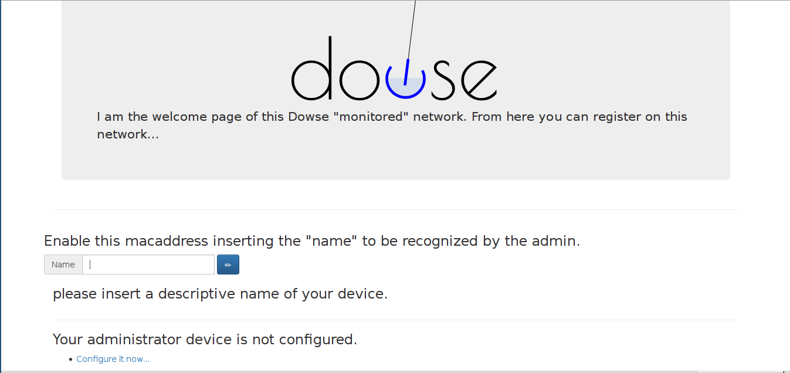
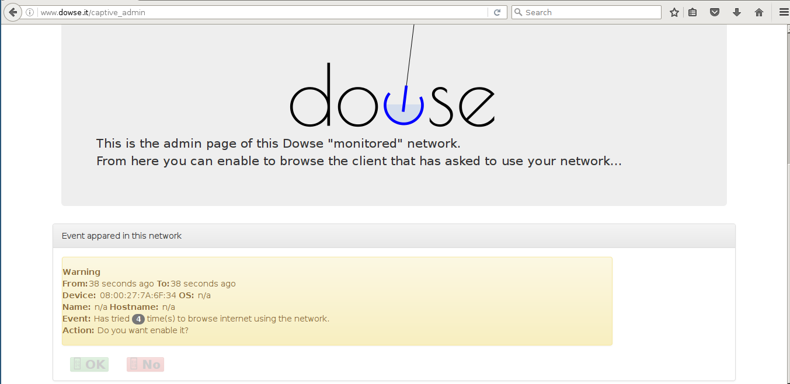

# Dowse Configuration

To properly configure Dowse, we suggest to keep in mind the role of any configuration file.

They are:
* `/etc/dowse/settings`
* `/etc/dowse/network?`


## /etc/dowse/settings

In this file you can configure all parameter that characterize the Dowse box, to instance the value you should use the typical syntax "`<em>key</em>=<em>value</em>` and the hash `#` to comment .

The parameter more frequently configured are :
- interface : it's the network interface to expose the internal dowse network.
- address : it's the dowse host address.
- dowse_net : it's the dowse network mask.
- dowse_guests : it's DHCP server parameter to distribute the address (it's expressed in the form <em>start address</em>,<em>end address</em>,<em>lease time</em>.
- wan : it's the network address behing to masquerade the network.
- internet_interface : it's the network interface should be routed to provide internet access.
- dns : it's the external DNS providing dns query resolution services.

# First navigation

1) You should connect to :
```
http://www.dowse.it/
```

and you look an web page like this:



Click on "Configure it now" from the device that you want to grant admin privileges.

go to

```
www.dowse.it/captive_admin
```

At the page bottom you are going to find a panel like:


describing the event occured.
In this case your device has tried to browse the internet 4 times.

Click on `Ok` to enable the device to navigate onn the network.
